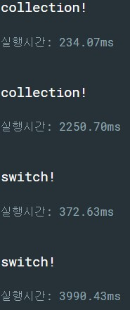

# Collection

## 목적 : 패턴이 있는 결과값을 collection으로 저장하여 효율적으로 프로그래밍하자

### collection이란 ? 데이터를 그룹으로 저장할 수 있는 메모리구조(자료구조) : stack, queue, heap, list, array etc.
### 장점 : 패턴별로 미리 메모리에 적재했기 때문에 처리속도의 효율이 상승한다
### 단점 : 메모리에 미리 적재해야 하기 때문에 메모리 효율은 떨어진다.

### self example code
- 달력 연,월별 일자 출력  
    - class를 활용하여 기본적으로 12월까지의 default day 값을 지정함
    - 윤달의 기준이 되는 2에서 조건문을 활용, 윤달과 비윤달의 경우 return의 차이를 줌
    - idx기반의 접근을 통해 연산을 최소화 한 collection의 형태로 생각함
[collection_calendar](collection_ex.cpp)
```cpp
#include <iostream>

using namespace std;

class calendar {
public:
	calendar(int nowyear, int nowmonth) {
		this->year = nowyear;
		this->month = nowmonth-1;
	}
	int getday() {
		if(this->month !=2)
			return days[this->month];
		else {
			if (!(this->year % 4) && ((this->year % 100) || !(this->year % 400)))
				return days[this->month] + 1;
			else
				return days[this->month];
		}
	}
private:
	int year = 0, month = 0;
	int days[12] = {31, 28, 31, 30, 31,30,31,31,30,31,30,31 };
};

int main(void) {
	int y, m;
	cout << "---Calendar day calculator---\nINPUT YEAR:: ";
	cin >> y;
	cout << "INPUT MONTH(1~12):: ";
	cin >> m;
	calendar thisyear = calendar(y, m);
	cout << "YEAR :: " << y << " MONTH :: " << m << " HAS "<<thisyear.getday() <<" DAYS\n";
}
```

### 결과
- runtime 비교(위 :: 1000만회, 아래 :: 1억회)
  
- 비교 대상 코드(switch문 활용)
```cpp
class calendar{
    public:
   calendar(int nowyear, int nowmonth) {
		this->year = nowyear;
		this->month = nowmonth-1;
	}
	int getday() {
		switch(this->month){
            case 0:case 2:case 4:case 6:case 8:case 9:case 11:
                return 31;
            case 3:case 5: case 7: case 10:
                return 30;
            case 1:
			    if (!(this->year % 4) && ((this->year % 100) || !(this->year % 400)))
				    return 29;
			    else
				    return 28;
		}
	}
    private:
	int year = 0, month = 0;
};
```
- collection을 사용할 시 switch를 사용한 코드에 비해 시간이 약 2/3로 감소하는 것을 실제 확인할 수 있었음
- 메모리의 여유가 있다면 실행시간을 고려해 collection형태로 코드를 작성하는 것이 좋을 것 같다
