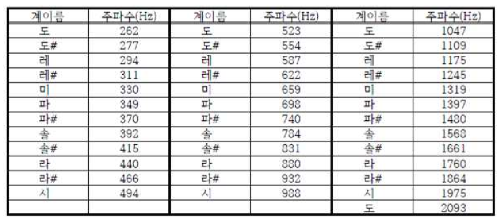

# 제작목표 :: rpi softone maker(악보 => 음악출력)
- raspberry pi의 wiring pi의 softone 라이브러리를 활용함
- 출력 주파수와 음계를 1:1 매핑, string 형태의 입력을 실제 연주 가능한 악보로 저장하는 것을 목표로 제작했다
- 해싱을 통해 연주 가능한 음을 hash table에 저장하고, 입력값과 hash의 value를 매핑, 배열에 저장해둔 뒤 입력 종료 후 출력  
## softtone 주파수와 음 매핑 정보↓


[source_code](makesomenoise.c)
```c
#include <wiringPi.h>
#include <wiringSerial.h>

#include <softTone.h> //beep sound
#include <stdio.h>
#include <stdlib.h>
#include <string.h>
#include <stdint.h> //uint8_t definitions
#include <errno.h>

#define SPEAKER 6 // wiringpi :: use GPIO 6 for beep speaker
#define MAXSIZE 2048 // max note size
#define MAXNOTE 5 // buffer for input
#define MOD 2003 // hash modular
int sound[37] = { 262, 277, 294, 311, 330, 349, 270, 392, 415, 440, 466, 494,
523, 554, 537, 622 ,659 ,698, 740,784,831,880,932,988,
1047,1109,1175,1245,1319,1397,1480,1568,1661,1760,1864,1975,2093 };
char* notes[37] = { "c1", "c#1", "d1", "d#1", "e1", "f1", "f#1", "g1", "g#1", "a2", "a#2", "b2",
"c2", "c#2", "d2", "d#2", "e2", "f2", "f#2", "g2", "g#2", "a3", "a#3", "b3",
"c3", "c#3", "d3", "d#3", "e3", "f3", "f#3", "g3", "g#3", "a4", "a#4", "b4","c4" };
int hashed[MOD];
int soundnote[MAXSIZE];

void activate(int num) {
	softToneCreate(SPEAKER);
	for (int i = 1; i <= num; ++i) {
		softToneWrite(SPEAKER, sountnote[i]);
		delay(500);
	}
}

int Hash(char* arr) {
	int mul = 1;
	int x = 0;
	int i;
	for (i = 0; arr[i] != 0; i++) {
		x = ((arr[i] * mul) + x) % MOD;
		mul *= 7;
	}
	if (x < 0)x = -x;
	return x % MOD;
}

void main() {
	if (wiringPiSetup() == -1) {
		fprintf(stdout, "Unable to start wiringPi: %s\n", strerror(errno));
		exit(1); //error
	}
	int i;
	for (i = 0; i < 37; ++i) { // make sound to hash
		int _mod = Hash(notes[i]);
		if (hashed[_mod]) {
			printf("hash collision!\n");
			exit(1);
		}
		hashed[_mod] = sound[i]; // sound id -> frequency
	}

	int n;

	printf("put length of soundnote :: ");
	scanf("%d", &n);
	for (i = 1; i <= n; ++i) {
		printf("put %d note(c~a + [#] + octave[1~4]) :: ", i);
		char s[MAXNOTE];
		scanf("%s", s);
		int _imod = Hash(s);
		if (!hashed[_imod]) { // check hash
			printf("undefined note!\n");
			--i;
			continue;
		}
		soundnote[i] = hashed[_imod];
		printf("%d inputed!\n", soundnote[i]);
	}
	activate();
}
```

## 후기
- key - value mapping을 위해 hash 함수를 적용해보았다
- 추가적으로 음의 길이(delay) 관련 배열을 생성, 적용하면 8비트 음악을 그럴듯하게 만들 수 있지 않을까
- 집에 rpi가 없어서 입, 출력 테스트만 해본것은 안비밀.... 근데 잘 나올거다 아마도..?
