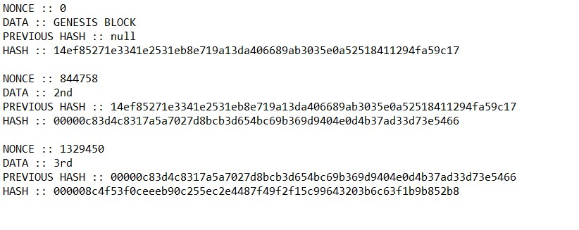

# 200318 Block chain 간단 구현

### 블록 : 관리 대상 데이터
### 체인 : 연결 고리(포인터가 아닌 해시값 참조로 연결되어 있다)
### 해시 : 해시 함수를 통해 얻는 결과, 무한한 데이터를 유한한 인덱스로 줄여주는 개념으로 해시테이블을 활용하기도 하나, 여기서는 단방향 암호화 알고리즘으로 sha256을 활용
### Nonce : Proof of Work(POW)를 검증하기 위한 값. 주어진 기준에 맞는 해시를 찾아가는 과정으로 Nonce값을 변경하여 최종 해시값을 찾아간다.
#### 틀린 부분은 lagoon9024@gmail.com으로 알려주시면 감사하겠습니다.

### 블록과 체인을 만들어보자!
- sha256 알고리즘을 cpp는 내장하고 있지 않아 java를 활용해 작성
- arraylist형태로 chaining을 해주었고, 추가되는 블록을 생성 시 previous hash, data, nonce값을 활용해 해시를 주어줬다.
- 결과 역시 previous 해시와 잘 연결된 것을 확인 할 수 있다.
  
- [source code](block.java)
```java
import java.security.*;
import java.util.ArrayList;


public class block {
	private static ArrayList<Node> Blockchain = new ArrayList<Node>();
	private static void mining(String data) {
		if(Blockchain.isEmpty()) Blockchain.add(new Node(data));
		else {
			String prevHash = Blockchain.get(Blockchain.size()-1).gethash();
			Blockchain.add(new Node(data,prevHash));
		}
	}
	
	public static void main(String[] args){
		mining("GENESIS BLOCK");
		mining("2nd");
		mining("3rd");
		for(int i=0; i<Blockchain.size();++i) {
			Blockchain.get(i).printBlock();
		}
	}
}

class Node { // 블록 구조체에 대한 클래스
	private String hash; // 외부의 접근을 방지하고자 private 변수로 선언해 주었다.
	private String prevhash;
	private String data;
	private int nonce=0;
	
	public Node(String data) { // genesis 블록 생성용 함수
		this.data = data;
		newBlock();
	}
	
	public Node(String data, String prevhash) { //이후 블록 생성용 함수
		this.data= data;
		this.prevhash = prevhash;
		newBlock();
	}
	
	public void printBlock() { // private형태의 결과 출력을 위한 함수
		System.out.println("NONCE :: "+nonce);
		System.out.println("DATA :: "+data);
		System.out.println("PREVIOUS HASH :: "+prevhash);
		System.out.println("HASH :: "+hash +"\n");
	}
	
	public String gethash() { // previous hash를 얻기 위해 만든 함수
		return this.hash;
	}
	
	private void newBlock() { // 블록의 내용을 만든다 -> hash값을 만들어준다
		if(prevhash!=null) {
			while(hash == null || !(hash.substring(0,5).equals("00000"))) { // hash 생성 규칙 적용 -> 첫 5자리가 00000인 경우일때까지 nonce를 증가시키며 해시를 구한다
				++nonce;
				hash = sha256(prevhash+data+Integer.toString(nonce));
			}
		}
		else
			hash=sha256(data+Integer.toString(nonce)); // 제네시스블록은 규칙적용을 해주지 않는다
	}
	
	public static String sha256(String msg){ // 내장된 sha256 알고리즘 https://needjarvis.tistory.com/251를 참조했다
		String SHA;
		try {
		MessageDigest md = MessageDigest.getInstance("SHA-256");
		md.update(msg.getBytes());
		SHA = bytesToHex1(md.digest());
		}catch(NoSuchAlgorithmException e) {
			SHA = null;
		}
		return SHA;
	}
	
	public static String bytesToHex1(byte[] bytes) {
		StringBuilder builder = new StringBuilder();
		for(byte b: bytes) {
			builder.append(String.format("%02x",b));
		}
		return builder.toString();
	}	
}
```
### 애 먹은 부분
- 아무래도 아직 자바는 익숙하질 못하다..
- try catch 구문 및 throws exception에 대한 학습이 더 필요하다 https://wikidocs.net/229 를 통해 더 공부해보자
### 더 필요한 부분
- hash값을 기준으로 각 블록을 검증하는 코드는 생성을 안했다 -> 검증이 되어야 블록체인이지..
- nonce값 찾아가는 데 엄청 느린 것을 볼 수 있었다. 그래서 그래픽카드를 죽이나보다.
