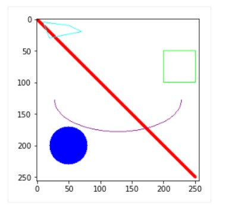

# Google Colab과 OpenCV를 사용해보자!
- 오늘은 python을 사용한다
  - C나 JAVA를 쓰던 사람을 위한 간단 python tutorial :: https://haloper.tistory.com/32
  - python 코딩도장 :: https://dojang.io/course/view.php?id=7

### Colab이란? Jupyter Notebook(Markdown + codeEditor + code실행) + Cloud
- 구글의 클라우드 환경에서 Jupyter Notebook을 활용 할 수 있는 어플리케이션
- GPU(Graphics processor unit), TPU(Tensor ...)를 무료로 사용 가능하고, Google Drive의 데이터를 가져올 수 있다
- 실행 가능 언어는 python
- 코드 스니펫으로 재사용 가능한 코드와 예제를 제공해서 편리하게 사용 가능하다
- 공식 사이트 :: https://colab.research.google.com/
- 간단 사용 설명
  - https://zzsza.github.io/data/2018/08/30/google-colab/ 
  - https://theorydb.github.io/dev/2019/08/23/dev-ml-colab/

### OpenCV (Open Source Computer Vision)

- 실시간 컴퓨터 비전을 목적으로 한 프로그래밍 라이브러리라고 한다
- Open Source로 제공되고 Window, Linux 모두 사용가능한 크로스플랫폼이다
- Tensorflow, Pytorch 등 딥러닝 프레임워크를 지원하여 영상쪽 AI에 많이 활용되는 것으로 알고있다
- 공식 사이트 :: https://opencv.org/
  - 튜토리얼 :: https://docs.opencv.org/master/d6/d00/tutorial_py_root.html

### OpenCV를 사용해보자 :: 간단한 도형그리기(Drawing API 활용)
- [opencv_draw_ex](opencv_draw_ex.py)
```python
import cv2
import numpy as np
from matplotlib import pyplot as pit

#이미지 버퍼 생성
buffer = np.full((256,256,3),255,np.uint8)

#이미지 버퍼 가공
cv2.line(buffer,(0,0),(250,250),(255,0,0),3)
# line(가공대상, 시작점, 끝점, color(RGB255), pixel(두께))
cv2.circle(buffer,(50,200),30,(0,0,255),-1)
# circle(가공대상, 원점, 반지름, color, 두께(0보다 작은수 => 채우기))
cv2.rectangle(buffer, (200,50),(250,100),(0,255,0),1)
# rectangle(가공대상, 시작점, 끝점, color, 두께(0보다 작은수 => 채우기))
cv2.ellipse(buffer,(128,128),(100,50),0,0,180,(128,0,128),1)
# 가공대상, 중점, (장축,단축), 시작각도, 끝각도, 호 비율(0~360), color, 두께)
pts = np.array([[10,5],[20,30],[70,20],[50,10]], np.int32)
pts = pts.reshape((-1,1,2))
cv2.polylines(buffer,[pts],True,(0,255,255))
# 폴리곤. 점위치설정 & 그리기

#이미지 버퍼 출력
pit.imshow(buffer)
pit.show()
```


### OpenCV을 사용해보자 :: face recognition
- face_recognition 라이브러리를 활용해 얼굴인식 및 대조를 해보자
1. face detecting [facedetect_ex](facedetect_ex.py)
```python
import cv2, os
import face_recognition as fr
from IPython.display import Image, display
from matplotlib import pyplot as pit

Image_path = "image_path"

image = fr.load_image_file(Image_path)
face_locations = fr.face_locations(image)

for(top,right,bottom,left) in face_locations: #face_location 함수를 통해 얼굴 기준으로 value 생성
  cv2.rectangle(image, (left,top),(right,bottom),(0,255,0), 3)
  
#이미지 버퍼 출력
pit.rcParams["figure.figsize"]=(16,16) #figure 사이즈(axis 눈금 갯수) 지정
pit.imshow(image)
pit.show()
```
  - 단체사진에 적용해보면 얼굴만 잘 찾아준다
2. 얼굴 비교하기(동일인 찾기) [findperson_ex](findperson_ex.py)
```python
import cv2, os
import face_recognition as fr
from IPython.display import Image, display
from matplotlib import pyplot as pit

pit.rcParams["figure.figsize"] = (1,1)
# 이미지 파일을 로드하여 list 생성
person_list = []
person_list.append(fr.load_image_file("image_path"))
person_list.append(fr.load_image_file("image_path"))
person_list.append(fr.load_image_file("image_path"))
person_list.append(fr.load_image_file("image_path"))

face_list = []
for person in person_list:
  # 얼굴좌표 파악 및 cut과정
  top, right, bottom, left = fr.face_locations(person)[0] #첫번째로 발견된 얼굴(독사진이니까..)
  face_image = person[top:bottom, left:right] #배열로 이미지 전체를 저장

  #list에 저장
  face_list.append(face_image)

#저장한 얼굴 출력
for face in face_list:
  pit.imshow(face)
  pit.show()
  
# load unknown
unknown = fr.load_image_file("image_path")

# cut face
top, right, bottom, left = fr.face_locations(unknown)[0]
unknown_face = unknown[top:bottom, left:right]

# display with title :: unknown
pit.title("unknown")
pit.imshow(unknown_face)
pit.show()

# encoding unknown face
enc_unknown_face = fr.face_encodings(unknown_face)

# display
pit.imshow(enc_unknown_face)
pit.show()

# compare with regstered faces
for face in face_list:
  # encoding 128-demensinal face
  enc_face= fr.face_encodings(face)

  # get distance with unknown
  distance = fr.face_distance(enc_face, enc_unknown_face[0])

  # display with distance value
  pit.title("distance :: "+str(distance))
  pit.imshow(face)
  pit.show()
```
  - 같은 사람의 경우 distance가 적게 나오는 것을 확인 할 수 있다
 
### 후기
- Colab
  - python 환경을 설치 하지 않고 웹상에서 빠르게 활용할 수 있는 것이 매력적이었다
  - 개인 pc의 사양 문제를 구글 클라우드환경을 통해 해결할 수 있어 빅데이터, AI관련 프로젝트 활용시 편리할 것으로 생각한다
- OpenCV
  - 기대 결과가 잘 출력되는 것을 확인할 수 있었고, 활용도가 높을 것으로 생각된다
  - 차후 AI, 빅데이터 관련 프로젝트 수행시 용이하게 활용할 것으로 생각한다
  - 개인적으로 OpenCV 내 face_recognition 과정 중 Encode를 어떤 과정을 통해 진행하는지 궁금증이 생겨 추가적으로 학습할 예정이다
    - 나중에 참고해보기 :: https://github.com/jeonggunlee/faceid
